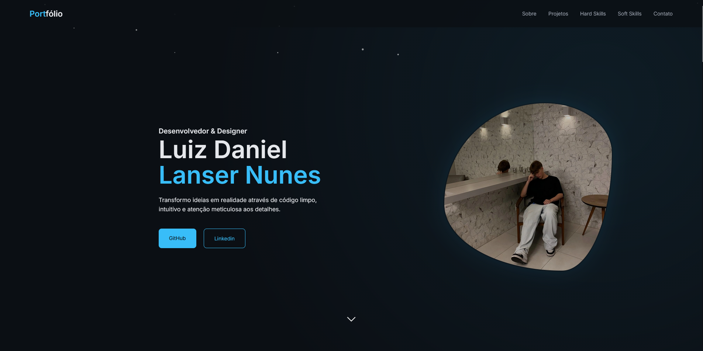

# 💼 Personal Portfolio — Luiz Daniel

Welcome to my personal portfolio!  
This project was created to showcase my **technical skills**, **projects**, and **experience** as a developer.

🔗 **Live Portfolio:**  
👉 https://luizdaniel-dev.vercel.app/

---

## 🧠 About the Project

This portfolio brings together some of my main projects, as well as information about my technical stack and soft skills.  
The main goal was to build a **modern**, **responsive**, and **user-friendly** application.

---

## 🚀 Technologies Used

- **HTML5**
- **CSS3**
- **JavaScript**
- **Vite**
- **Git & GitHub**
- **Vercel (Deployment)**

---

## 📂 Project Structure

```bash
├── public
├── src
│   ├── assets
│   │   └── icons
│   ├── imgs
│   ├── script.js
│   └── style.css
├── index.html
├── package.json
└── vite.config.js
```
## 📸 Preview


